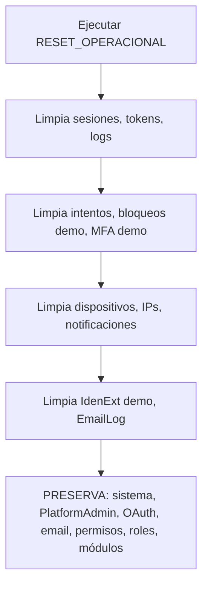

# Installation Order

> Generado: 2026-07-22  
> Propósito: Definir el orden de ejecución de los scripts SEED para instalaciones nuevas y existentes.

## 1. Instalación nueva (desde cero)

```
PASO 1: CREATE DATABASE PassPlat
PASO 2: PASSWORDS.sql (esquema completo + SPs + triggers)
PASO 3: SEED_Plataforma.sql (orquestador)
```

### SEED_Plataforma.sql ejecuta en orden:

```
:r Catalogo\01_Estados.sql           -- EstadosUsr, EstadosMFA, EstIdenExt
:r Catalogo\02_Tipos.sql             -- TiposMFA, TiposDisp, TiposCambioPwd,
                                      -- TiposBloqueo, TiposAuditoria, TipAsigPermiso
:r Catalogo\03_Resultados.sql        -- ResultadosAcceso
:r Catalogo\04_TiposModulo.sql       -- TiposModulo
:r Catalogo\05_ProvIden.sql          -- ProvIden (7 proveedores)
:r Catalogo\06_Apps.sql              -- App PassPlat

:r Configuracion\01_Modulos.sql      -- Árbol completo de módulos
:r Configuracion\02_Permisos.sql     -- ~100+ permisos
:r Configuracion\03_RolesGlobales.sql -- PLATFORM_ADMIN, _EDITOR, _SUPERVISOR, _CONSULTA
:r Configuracion\04_Infraestructura.sql -- Tenant PLATFORM, ConfigApp, PoliticasPwd,
                                          -- ConfigTenants, Dominios
:r Configuracion\05_OAuth.sql        -- ConfProvIden para PLATFORM
:r Configuracion\06_EmailConfig.sql  -- EmailAccounts, TenantEmailAccounts,
                                      -- AppEmailAccounts
:r Configuracion\07_Usuarios.sql     -- sistema (INTOCABLE) + PlatformAdmin
```

### Por cada nuevo tenant:

```
PASO 4: Editar SEED_Tenant.sql (cambiar @TenantCodigo, @AdminUsuario, etc.)
PASO 5: Ejecutar SEED_Tenant.sql
PASO 6: Ejecutar 03_VALIDATE.sql (certificar instalación)
```

### SEED_Tenant.sql ejecuta en orden:

```
:r Tenant\01_DatosGenerales.sql      -- INSERT tenant + Dominios + ConfigTenants
:r Tenant\02_RolesTenant.sql         -- {TENANT}_ADMIN, _EDITOR, _SUPERVISOR, _CONSULTA
:r Tenant\03_ConfProvIden.sql        -- 7 ConfProvIden × tenant
:r Tenant\04_EmailTenant.sql         -- TenantEmailAccounts + AppEmailAccounts
:r Tenant\05_AdminUsuario.sql        -- Admin + HistorialPwd + Acceso
:r Tenant\06_Accesos.sql             -- Grupos + GruposUsuarios + Accesos
```

## 2. Instalación existente (con datos)

```mermaid
flowchart TD
    A[Backup BD] --> B[Ejecutar RESET_OPERACIONAL]
    B --> C[Ejecutar SEED_Plataforma<br/>(solo bloques idempotentes)]
    C --> D[Ejecutar SEED_Tenant<br/>para cada tenant existente]
    D --> E[Ejecutar VALIDATE]
    E --> F{¿Todo verde?}
    F -->|Sí| G[Producción]
    F -->|No| H[Revisar incidencias]
```

**Regla**: En instalaciones existentes, SEED_Plataforma solo ejecuta bloques con `IF NOT EXISTS` / `MERGE`. Nunca hace `DELETE FROM` en tablas de configuración.

## 3. RESET_OPERACIONAL (desarrollo)



## 4. 03_VALIDATE (post-instalación)

Ejecutar siempre después de:
- Instalación nueva
- Agregar un nuevo tenant
- Ejecutar RESET_OPERACIONAL
- Actualizar seed manualmente

El script debe producir 0 errores para considerar la instalación certificada.

## Orden de limpieza (RESET_OPERACIONAL)

```
1. Sesiones
2. TokensRest
3. IntentosAcceso
4. Bloqueos (demo)
5. MFA (demo)
6. Disp, DispConfiables (demo)
7. IPs, UserAgents (demo)
8. Notificaciones
9. EmailLog
10. IdenExt (demo), IdenExtTokens (demo), HistorialIdenExt (demo)
11. AuditoriaPwd, AudIdenExt
12. GruposUsuarios (demo), Grupos (demo)
13. HistorialPwd (excepto sistema y admins)
```

## Orden inverso: purga completa para reinstalación

```
SOLO para instalaciones existentes que requieren reset completo:
(No recomendado si hay datos de producción)

1. Backup completo
2. DELETE FROM en orden inverso al de carga
3. DBCC CHECKIDENT RESEED en tablas con Identity
4. Ejecutar SEED_Plataforma completo
```
