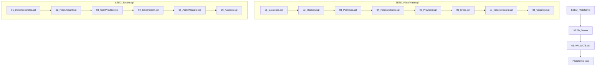

# Seed Architecture

> Generado: 2026-07-22  
> Propósito: Documentar la arquitectura, reglas y convenciones de los scripts SEED de PassPlat.

---

## 1. Filosofía

Separación completa entre **infraestructura de plataforma** y **datos de clientes** mediante dos scripts independientes:

- **SEED_Plataforma.sql**: Instala la plataforma PassPlat con un único tenant (PLATFORM). Se ejecuta una sola vez.
- **SEED_Tenant.sql**: Plantilla reutilizable para crear nuevos tenants/clientes. Se ejecuta una vez por cada nuevo inquilino.

## 2. Estructura de archivos

```
/BBDD/Seed/
│
├── SEED_Plataforma.sql           ← Orquestador SQLCMD (:r)
├── SEED_Tenant.sql               ← Plantilla reutilizable con parámetros SET
├── 03_VALIDATE.sql               ← Certificación post-instalación
├── 04_RESET_OPERACIONAL.sql      ← Limpieza de datos operacionales (desarrollo)
│
├── Catalogo/                     ← NUNCA cambia por instalación
│   ├── 01_Estados.sql            ← EstadosUsr, EstadosMFA, EstIdenExt
│   ├── 02_Tipos.sql              ← TiposMFA, TiposDisp, TiposCambioPwd, TiposBloqueo,
│   │                                TiposAuditoria, TipAsigPermiso
│   ├── 03_Resultados.sql         ← ResultadosAcceso
│   ├── 04_TiposModulo.sql        ← TiposModulo (SYSTEM, TENANT, SHARED)
│   ├── 05_ProvIden.sql           ← 7 proveedores OAuth (catálogo puro)
│   └── 06_Apps.sql               ← App PassPlat (única)
│
├── Configuracion/                ← Cambia por instalación
│   ├── 01_Modulos.sql            ← Árbol completo de módulos
│   ├── 02_Permisos.sql           ← ~100+ permisos
│   ├── 03_RolesGlobales.sql      ← PLATFORM_ADMIN, _EDITOR, _SUPERVISOR, _CONSULTA
│   ├── 04_Infraestructura.sql    ← Tenant PLATFORM, ConfigApp, PoliticasPwd,
│   │                                ConfigTenants, Dominios
│   ├── 05_OAuth.sql              ← ConfProvIden para PLATFORM
│   ├── 06_EmailConfig.sql        ← EmailAccounts, TenantEmailAccounts, AppEmailAccounts
│   └── 07_Usuarios.sql           ← sistema (INTOCABLE) + PlatformAdmin
│
├── Tenant/                       ← Plantilla reutilizable por cliente
│   ├── 01_DatosGenerales.sql     ← INSERT tenant + Dominios + ConfigTenants
│   ├── 02_RolesTenant.sql        ← {TENANT}_ADMIN, _EDITOR, _SUPERVISOR, _CONSULTA
│   ├── 03_ConfProvIden.sql       ← 7 ConfProvIden × tenant
│   ├── 04_EmailTenant.sql        ← TenantEmailAccounts + AppEmailAccounts
│   ├── 05_AdminUsuario.sql       ← Admin + HistorialPwd + Acceso
│   └── 06_Accesos.sql            ← Grupos + GruposUsuarios + Accesos
│
├── Demo/                         ← Opcional
│   └── 01_DemoData.sql
│
└── Validacion/
    ├── 01_Integridad.sql         ← FK, duplicados, CHECKSUM RowVersion
    ├── 02_Seguridad.sql          ← Controller→Policy→Permiso→Módulo→Rol
    └── 03_SeedCobertura.sql      ← seed vs código vs BD
```

## 3. Reglas estándar para scripts SQL

### 3.1 Id funcional vs Id técnico

```sql
-- ❌ MAL: depender de Id para lógica
WHERE IdRol = 1

-- ✅ BIEN: usar Código
WHERE r.Codigo = 'PLATFORM_ADMIN'
```

### 3.2 Idempotencia en catálogos

```sql
-- Catálogos: IF NOT EXISTS
IF NOT EXISTS (SELECT 1 FROM dbo.EstadosUsr WHERE Codigo = 'Activo')
    INSERT INTO dbo.EstadosUsr (Codigo, Nombre, Descripcion) VALUES ('Activo', 'Activo', '...')
```

### 3.3 Idempotencia en configuración

```sql
-- Configuración: MERGE
MERGE dbo.ConfigApp AS target
USING (SELECT 'General', 'AppName', 'AccessPlat') AS source (Grupo, Clave, Valor)
ON target.Grupo = source.Grupo AND target.Clave = source.Clave
WHEN NOT MATCHED THEN INSERT (IdTenant, Grupo, Clave, Valor, Tipo, Descripcion, Activo)
    VALUES (NULL, source.Grupo, source.Clave, source.Valor, 'string', '...', 1);
```

### 3.4 Catálogos no se eliminan nunca

```sql
-- ❌ NUNCA
DELETE FROM dbo.EstadosUsr

-- ✅ Solo si es necesario resetear
-- NO APLICA para catálogos
```

### 3.5 Usuario sistema no se modifica

```sql
-- ❌ NUNCA
UPDATE dbo.Usuarios SET Email = 'nuevo@email.com' WHERE Id = 1

-- ❌ NUNCA
DELETE FROM dbo.HistorialPwd WHERE IdUsuario = 1

-- ✅ Solo consulta
SELECT 1 FROM dbo.Usuarios WHERE Id = 1 AND EsSistema = 1
```

### 3.6 Finalización con validación

```sql
-- Cada script debe terminar con validación
IF NOT EXISTS (SELECT 1 FROM dbo.Usuarios WHERE Id = 1)
    THROW 50001, 'CRÍTICO: Usuario sistema no encontrado después del seed', 1;
```

## 4. Formato del SEED_Tenant.sql

```sql
-- =============================================
-- SEED_TENANT - Plantilla de creación de tenant
-- =============================================
-- Editar SOLO las variables en CONFIGURACIÓN.
-- =============================================

-- =============================================
-- CONFIGURACIÓN
-- =============================================
DECLARE @TenantCodigo      nvarchar(30)
DECLARE @TenantNombre      nvarchar(200)
DECLARE @TenantDominio     nvarchar(255)
DECLARE @TenantTimeZone    nvarchar(50)
DECLARE @TenantCulture     nvarchar(10)
DECLARE @AdminUsuario      nvarchar(50)
DECLARE @AdminEmail        nvarchar(255)
DECLARE @PasswordTemporal  nvarchar(128)
DECLARE @OAuthEnabled      bit
DECLARE @EmailProvider     nvarchar(30)

-- VALORES POR DEFECTO
SET @TenantCodigo     = 'ABARROTES'
SET @TenantNombre     = 'Abarrotes del Sur'
-- ... (resto de valores)

-- =============================================
-- EJECUCIÓN
-- =============================================
PRINT 'Creando tenant ' + @TenantCodigo + '...';

:r Tenant\01_DatosGenerales.sql
:r Tenant\02_RolesTenant.sql
:r Tenant\03_ConfProvIden.sql
:r Tenant\04_EmailTenant.sql
:r Tenant\05_AdminUsuario.sql
:r Tenant\06_Accesos.sql

PRINT 'Tenant ' + @TenantCodigo + ' creado exitosamente.';
GO
```

## 5. Diagrama de dependencias



## 6. Estrategia por tipo de tabla

| Tipo | Creación | Actualización | Eliminación | Reset |
|------|----------|---------------|-------------|-------|
| **Catálogo** | IF NOT EXISTS | Nunca | Nunca | No aplica |
| **Config. Plataforma** | IF NOT EXISTS | MERGE | Nunca | Reset manual |
| **Config. Tenant** | IF NOT EXISTS | UPDATE | Al eliminar tenant | No aplica |
| **Operacional** | Autogenerado | Autogenerado | RESET_OPERACIONAL | Sí |
| **Demo** | DELETE + INSERT | No aplica | RESET_OPERACIONAL | Sí |

## 7. Resumen de archivos resultantes

| Archivo | Líneas estimadas | Bloques |
|---------|-----------------|---------|
| SEED_Plataforma.sql | ~50 | Orquestador (:r) |
| Catalogo/01_Estados.sql | ~80 | 3 tablas |
| Catalogo/02_Tipos.sql | ~120 | 6 tablas |
| Catalogo/03_Resultados.sql | ~40 | 1 tabla |
| Catalogo/04_TiposModulo.sql | ~30 | 1 tabla |
| Catalogo/05_ProvIden.sql | ~50 | 1 tabla (7 rows) |
| Catalogo/06_Apps.sql | ~30 | 1 tabla |
| Configuracion/01_Modulos.sql | ~150 | ~35-40 módulos |
| Configuracion/02_Permisos.sql | ~200 | ~100+ permisos |
| Configuracion/03_RolesGlobales.sql | ~80 | 4 roles + RolesPermisos |
| Configuracion/04_Infraestructura.sql | ~100 | Tenants + ConfigApp + Politicas |
| Configuracion/05_OAuth.sql | ~50 | ConfProvIden PLATFORM |
| Configuracion/06_EmailConfig.sql | ~100 | Accounts + asignaciones |
| Configuracion/07_Usuarios.sql | ~60 | sistema + PlatformAdmin |
| SEED_Tenant.sql | ~50 | Orquestador (:r) |
| Tenant/01_DatosGenerales.sql | ~60 | 1 tenant |
| Tenant/02_RolesTenant.sql | ~50 | 4 roles + permisos |
| Tenant/03_ConfProvIden.sql | ~60 | 7 configs OAuth |
| Tenant/04_EmailTenant.sql | ~40 | Asignaciones email |
| Tenant/05_AdminUsuario.sql | ~50 | Admin + HistorialPwd |
| Tenant/06_Accesos.sql | ~80 | Grupos + Accesos |
| 03_VALIDATE.sql | ~200 | Certificación |
| 04_RESET_OPERACIONAL.sql | ~100 | Limpieza operacional |
